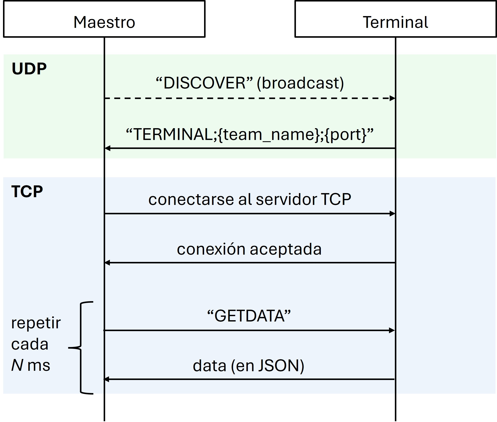
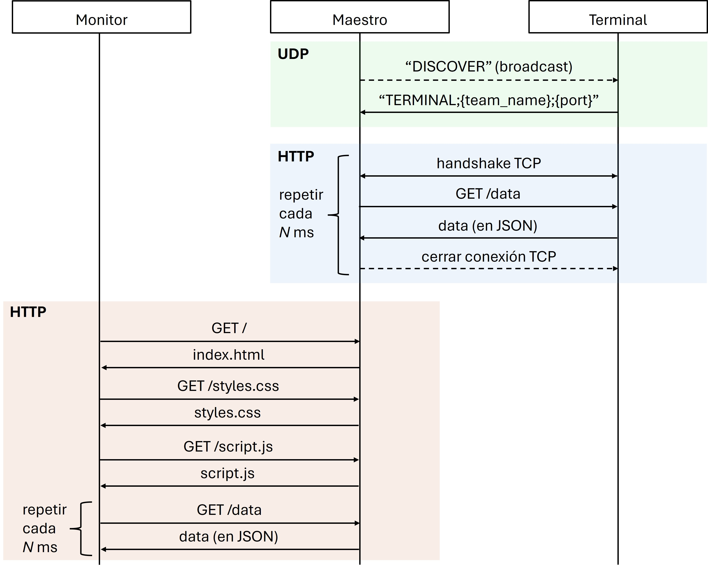

# utn-circuitmaster

Repositorio para el controlador maestro del laboratorio de microcontroladores de Tecnologías para la Automatización, UTN FRRe 2024.

El código MicroPython en `maestro/` sirve para el único microcontrolador maestro de la red. El código en `terminal/` contiene el boilerplate necesario para cada microcontrolador terminal, y deberá ser personalizado por cada equipo para que se pueda adaptar al código específico de ese equipo. Este repositorio se encarga del:

- **Descubrimiento de la red**: que el maestro y los terminales se vinculen automáticamente.
- **Polling**: desde el maestro, monitorear en tiempo real el estado de todos los terminales.
- **Dashboard**: desde un dashboard web, monitorear en tiempo real el estado de todos los terminales de la red.

Se utiliza la librería `asyncio` para la ejecución concurrente de:

- En el maestro: el servidor HTTP, el descubrimiento de la red, y el polling a los terminales.
- En cada terminal: la escucha de mensajes de descubrimiento, el servidor HTTP para responder a los polls del maestro, y el código específico del equipo.

Nota: los archivos `/terminal/micro_monitoring.py` y `/terminal/circuit_monitoring.py` están orientados específicamente para MicroPython y CircuitPython respectivamente. Cumplen la misma funcionalidad, aunque cada equipo debe usar el que corresponde al runtime que decidieron utilizar.

## Conexión a WiFi

Al iniciarse los dispositivos, intentan conectarse a una red WiFi local cuyo `WLAN_SSID` y `WLAN_PASSWORD` se indican en constantes globales en los archivos `/maestro/main.py` y `/terminal/{circuit|micro}_monitoring.py`.

Es necesario que estén conectados a la red local para poder comunicarse con el resto de controladores.

## Descubrimiento de la Red

El maestro envía periódicamente un mensaje de broadcast UDP en la red local. Si un terminal detecta uno de estos broadcasts, responde con un UDP dirigido que incluye el nombre del equipo, su dirección IP, y el puerto TCP de su servidor HTTP. El maestro guarda esta información para luego realizar las peticiones HTTP al terminal.

Si el terminal no recibe peticiones HTTP del maestro luego de cierto tiempo, el terminal vuelve al "modo descubrimiento" a esperar un nuevo mensaje de broadcast para nuevamente enviar su dirección y puerto del servidor HTTTP al maestro. Esto permite que si el maestro falla o pierde este terminal, lo puede volver a encontrar.

## Polling del Maestro a los Terminales

El maestro tiene en todo momento un listado de los nueve terminales posibles que existen. El polling consiste en periódicamente iterar sobre esa lista y, por cada terminal cuya dirección IP y puerto del servidor HTTP se posee gracias al descubrimiento de la red, enviar una petición HTTP. Cada terminal responde con los datos (en formato JSON) que su equipo considera representativos.

Los datos obtenidos de todos los terminales son concentrados en el maestro en una sola variable global.

## Monitoreo Mediante Dashboard Web

De manera concurrente a la comunicación con los terminales, el maestro también ejecuta un servidor HTTP/1.1 que ante una petición `GET /` devuelve una página web definida en `/maestro/www`. Este dashboard web tiene un código JavaScript en `/maestro/www/script.js` que cada cierto intervalo de tiempo hace una petición `GET /data` al maestro, quien devuelve en formato JSON los datos más recientes de cada terminal en la red. Esto actualiza los datos mostrados en el navegador.

La comunicación entre monitor web, maestro, y terminales, es la siguiente:

